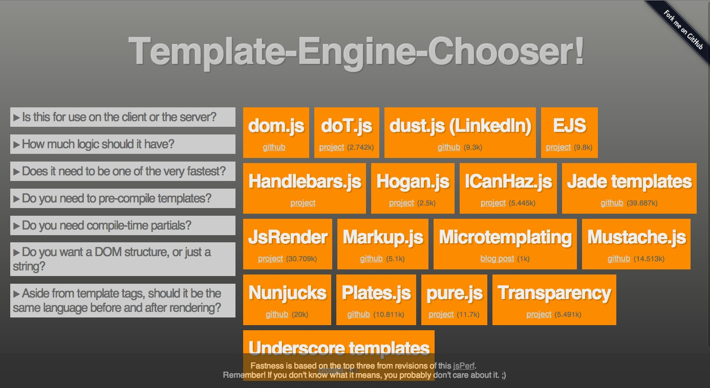

<h1>毕昇工作原理 <small>How BiSheng.js works</smaLL></h1>

## 文前

数据双向绑定，是指自动在视图和业务逻辑之间建立连接，并自动同步变化的前端技术。当业务逻辑导致数据发生变化时，自动同步更新 DOM；当用户操作导致表单元素发生变化时，自动同步更新数据。这种运行机制，避免掉了手工操作 DOM 所需的代码，使得前端攻城师可以用 [更清晰优雅的方式](http://en.wikipedia.org/wiki/Data-driven_programming) 来设计和实现业务逻辑。

> 数据双向绑定对开发体验的提升很是显著，而且会变革前端的开发模式和设计思路，犹如从雕版印刷到活字印刷的进步，我在开发 BiSheng.js 的过程中对此深有体会，非常值得各位试一试。

这篇文章不会再谈论实施数据双向绑定带来的好处是如何诱人，而是形而下地专注于对数据双向绑定的分析和实现。文章的内容基于编写 BiSheng.js 时的思考和尝试，灵感则来自于 [AngularJS] 和 [EmberJS]，结构借鉴了 [Patterns For Large-Scale JavaScript Application Architecture]（[中文翻译](http://nuysoft.com/2013/08/13/large-scale-javascript/)）。

[AngularJS]: http://angularjs.org/
[EmberJS]: http://emberjs.com/
[Patterns For Large-Scale JavaScript Application Architecture]: http://addyosmani.com/largescalejavascript/
[翻译]: http://nuysoft.com/2013/08/13/large-scale-javascript/

## 我是谁，以及我为什么写这个主题？

我目前是 [阿里妈妈](http://www.alimama.com/) 的一名 JavaScript 开发人员，负责 [钻石展位广告管理系统] 和 [DMP 数据营销系统]的前端开发。由于这些应用程序不仅复杂，而且需要快速迭代和高度可复用的架构，因此我的职责之一就是确保开发模式尽可能是可维护和可持续的。

已有的数据双向绑定实现大都是大而全的框架，对于既有应用程序的架构体系冲击太大，实施成本可比推倒重建，而且起步价大多是 IE8 或 IE9，所以借鉴意义更大些。为了学习这些实现，解决开发过程中没完没了没完没了的 DOM 操作，我开发了一个纯粹的数据双向绑定工具 [BiSheng.js]，现在我把思路和过程记录下来，让它们更条理一些，顺便作为 BiSheng.js 的设计文档。

BiSheng.js 的名称源自活字印刷术的发明者“[毕昇]”。因为单向绑定犹如“刻版印刷”，双向绑定犹如“活字印刷”，故名 BiSheng.js。

[钻石展位广告管理系统]: http://zuanshi.taobao.com
[DMP 数据营销系统]: http://dmp.taobao.com/
[BiSheng.js]: https://github.com/thx/bisheng
[毕昇]: http://baike.baidu.com/subview/33366/11034585.htm?fromtitle=%E6%AF%95%E5%8D%87&fromid=64860&type=syn

## 可以用 140 个字概述这篇文章吗？

如果你时间不够，下面是这篇文章的摘要，只有一条 tweet 的长度：

**修改语法树，插入定位符，渲染模板和定位符，解析定位符，建立数据到 DOM 元素的连接，建立 DOM 元素到数据的连接。**

## 数据双向绑定的关注点

我们先直观地分解一下数据双向绑定所要实现的目标：

1. 需要能够监听到数据的变化。
2. 需要能够将数据的属性关联到 DOM 元素上。
3. 需要能够监听到表单元素的变化。

其中，第 1 个和第 3 个目标是自动同步变化的关键，第 2 个目标则是在视图和业务逻辑之间建立连接的关键。

对于第 3 个目标，基于浏览器事件系统，为表单元素绑定一些默认事件（例如，keyup、change），就可以监听到表单元素的变化；关键还要看第 1 个和第 2 个目标的实现，这也是本文的核心内容。

## 监听数据

监听数据变化的可选方案并不少，一一逐条罗列和分析：

1. 建立数据的副本，用定时器（[setTimeout 或 setInterval]）周期性地与副本进行比较，并将变化封装成事件，用观察者（Pub/Sub）模式来实现事件广播。
2. 采用 ES5 规范中的 [Object.defineProperty] 和 [Object.defineProperties] 为属性定义 `get()` 和 `set()` 方法，依此来监听属性的读取和设置操作，功能上非常完善，但是 [IE9- 不支持](http://kangax.github.io/es5-compat-table/)，一些 Polyfill（例如，TODO）也不完善。
3. [Object.observe()] 也可以用来监听属性的变化，可是距离可应用也太远了。
4. 甚至你可能会想到 [Object.prototype.\_\_defineGetter\_\_] 和 [Object.prototype.\_\_defineSetter\_\_]，但是未被纳入规范，不过这不重点，关键是 [IE11 才会支持](TODO)。

所以，实用些的做法是，在 IE9+ 和其他浏览器中使用 `Object.defineProperty/defineProperties`，在 IE9- 中使用定时器 `setTimeout`。

> `Object.defineProperty/defineProperties` 的缺点在于无法检测未知属性，例如，对象中新增的属性和数组中新增的元素；定时器 `setTimeout` 的缺点在于（周期性运行必然会导致）不能及时反映数据的变化，此外，也会有性能和电量损耗的问题。

BiSheng.js 采用的是：

* 对于表单元素的变化，自动检测输入、更新数据和更新 DOM 元素。
* 对于手动更新数据，则调用 `BiSheng.apply()` 来触发更新 DOM 元素。

[setTimeout 或 setInterval]: http://stackoverflow.com/questions/729921/settimeout-or-setinterval

[Object.defineProperty]: https://developer.mozilla.org/en-US/docs/Web/JavaScript/Reference/Global_Objects/Object/defineProperty
[Object.defineProperties]: https://developer.mozilla.org/en-US/docs/Web/JavaScript/Reference/Global_Objects/Object/defineProperties

[Object.observe()]: http://wiki.ecmascript.org/doku.php?id=harmony:observe

[Object.prototype.\_\_defineGetter\_\_]: https://developer.mozilla.org/en-US/docs/Web/JavaScript/Reference/Global_Objects/Object/defineGetter
[Object.prototype.\_\_defineSetter\_\_]: https://developer.mozilla.org/en-US/docs/Web/JavaScript/Reference/Global_Objects/Object/defineSetter

## 模板引擎

模板引擎负责解析模板，并且用提供的真实数据替换替换占位符（变量、函数、循环等），因此模板引擎也是一种数据绑定实现，但尚是静态的、单向的，我们可以利用模板引擎的语法（即占位符的语法），将它扩展成动态的、双向的。

  

    
  

  

    
  

*图片来自 <http://docs.angularjs.org/guide/databinding>*

从存储方式上，模板引擎可以分为字符串模板和 DOM 模板。DOM 模板更方便解析数据属性和 DOM 元素之间的关系，字符串模板则在使用上更加灵活和方便。

从语法上，又可以分为弱逻辑语法和强逻辑语法。弱逻辑模板并不意味着模板中只能有简单的占位符，但是某些智能标签（即数组迭代、条件渲染）的功能确实相当有限，但弱模板可以在客户端和服务端之间开发和重用，提供最佳性能的同时仍然易于维护；强逻辑模板引擎则有更丰富的功能，并且可扩展，但容易形成意大利面条式的糟糕代码。

> 允许在模板中放置任意代码终究不是最好的主意。

从解析模板的方式上，模板引擎可以分为基于手写解析器和基于解析器生成器。基于手写解析器的模板引擎功能通常比较简单，大多通过正则或特殊符号对字符串进行解析、转义，而且不易扩展；而基于解析器生成器的模板引擎，则会先通过词法分析和语义分析把模板解析为语法树（[AST Abstract Syntax Tree]），然后再把语法树编译为可执行的函数，在分层结构上，比前者更加清晰和内聚。基于语法树的模板引擎也有着更好的扩展性，允许第三方通过再次解析或修改语法树，进而扩展出更多的功能，例如，反向生成数据，转译成其他模板引擎的语法，以及本文的主题：支持数据双向绑定。

模板引擎的实现各有权衡，如何选择则视需求而定。可以在 [这里](http://garann.github.io/template-chooser/) 看到各种模板引擎，并且通过几个问题从中筛选出你所中意的。

我认为适合实施数据双向绑定的有以下 2 种组合方案：

1. DOM 模板 + 弱逻辑语法 + 基于语法树
2. 字符串模板 + 弱逻辑语法 + 基于语法树

DOM 模板可以直接在 DOM 元素和数据属性之间建立连接，这实在是天生的优势，确实更容易一些。例如，AngularJS 就采用了这种方案。

字符串模板则需要做更多的处理，因为它的语法树没有体现出 DOM 结构，所以在把渲染结果转换为 DOM 元素后，还需要遍历 DOM 元素，建立与数据属性之间的连接。例如，EmberJS 就采用了这种方案。

总体而言，我倾向于选择 [Handlebars.js]，它属于第 2 种组合，可以运行在客户端和服务端，支持在服务端预编译模板，并且支持 Helper 方法。

BiSheng.js 也选择了 Handlebars.js 作为它支持的第一款模板引擎，不过这并不是唯一的选择，BiSheng.js 还允许扩展支持更多的模板引擎。

[Handlebars.js]: http://handlebarsjs.com/
[AST Abstract Syntax Tree]: http://en.wikipedia.org/wiki/Abstract_syntax_tree
[如何选择]: http://garann.github.io/template-chooser/
[Template-Engine-Chooser]: http://garann.github.io/template-chooser/

## 执行绑定

BiSheng.js 提供了方法 `BiSheng.bind(data, tpl, callback(content))`，用于在模板和数据之间执行双向绑定，文档请访问 [HTML](/doc/bisheng.html) 或 [Markdown](/doc/bisheng.md)。

`BiSheng.bind()` 绑定的关键步骤共有 5 步：

1. 修改语法树，插入定位符。
2. 渲染模板和定位符。
3. 解析定位符。
4. 建立数据到 DOM 元素的连接。
5. 建立 DOM 元素到数据的连接。

下面以模板 `{{title}}` 为例来说明 `BiSheng.bind()` 的绑定过程。绑定代码如下：

    // HTML 模板
    var tpl = '{{title}}'
    // 数据对象
    var data = {
      title: '注意，title 的值在这里'
    }
    // 执行双向绑定
    BiSheng.bind(data, tpl, function(content){
      // 然后在回调函数中将绑定后的 DOM 元素插入文档中
      $('div.container').append(content)
    });
    // 改变数据 data.title，对应的文档区域会更新
    data.title = 'bar'

### 1. 修改语法树，插入定位符

`BiSheng.bind()` 首先在 `{{title}}` 的前后插入两个转义后的定位符，在转义之前是：

    
    

其中，`$lastest` 是一个全局 Helper 方法，用于获取和输出被定位属性 `title` 的访问路径，代码如下所示：

    Handlebars.registerHelper('$lastest', function(items, options) {
        return items && items.$path || this && this.$path
    })

其中，`$path` 指示了当前属性的路径，由 BiSheng.js 自动计算和设置。

对应的语法树的变化代码太多，就不贴在这了，请移步这里 <https://gist.github.com/nuysoft/8055993>。

### 2. 渲染模板和定位符

然后执行 `Handlebars.compile(ast)(data)` 渲染模板和定位符，结果如下：
    
    &lt;script guid="1" slot="start" type="" path="1.title" isHelper="false"&gt;&lt;/script&gt;注意，title 的值在这里&lt;script guid="1" slot="end"&gt;&lt;/script&gt;

转以后的代码有些不易读，不过没关系，下一步就会解析它。

### 3. 扫描 DOM 元素，解析定位符

然后解析渲染结果中的定位符，结果如下：

    注意，title 的值在这里

### 4. 建立数据到 DOM 元素的连接

现在，对于属性 `title` 所对应的 DOM 元素，我们可以通过两个 script 元素来精确定位。

具体的做法是，当属性 `title` 更新时，可以通过选择器表达式 `script[slot="start"][path="1.title"]` 定位到第一个 script 元素，进而定位到所对应的 DOM 元素，然后更新 DOM 元素。

### 5. 建立 DOM 元素到数据的连接

这点在前面已经提过，通过为表单元素绑定一些默认事件（例如，keyup、change），就可以监听到表单元素的变化，进而更新数据属性。

### 小结

前面以 `{{title}}` 为例阐述了绑定过程。这尚是最简单的情况，事实上内部的实现比示例要复杂和繁琐许多，不过处理的步骤是一样的。

## 源码导读

**代码的结构**按照职责来设计，见下表；**打包后的文件**在 [dist/] 目录下；**API 和文档**在 [doc/] 目录下；**测试用例**在 [test/] 目录下，基本覆盖了目前已实现的功能。

源文件            | 职责 & 功能
----------------- | -------------------------------------
[src/ast.js]      | 修改语法树，插入定位符。
[src/bisheng.js]  | 双向数据绑定的入口。
[src/expose.js]   | 模块化，适配主流加载器。
[src/flush.js]    | 更新 DOM 元素。
[src/locator.js]  | 生成定位符，解析、更新定位符的属性。
[src/loop.js]     | 数据属性监听工具。
[src/scan.js]     | 扫描 DOM 元素，解析定位符。

[src/ast.js]: https://github.com/thx/bisheng/tree/master/src/ast.js
[src/bisheng.js]: https://github.com/thx/bisheng/tree/master/src/bisheng.js
[src/expose.js]: https://github.com/thx/bisheng/tree/master/src/expose.js
[src/flush.js]: https://github.com/thx/bisheng/tree/master/src/flush.js
[src/locator.js]: https://github.com/thx/bisheng/tree/master/src/locator.js
[src/loop.js]: https://github.com/thx/bisheng/tree/master/src/loop.js
[src/scan.js]: https://github.com/thx/bisheng/tree/master/src/scan.js

[dist/]: https://github.com/thx/bisheng/tree/master/dist/
[doc/]: https://github.com/thx/bisheng/tree/master/doc/
[test/]: https://github.com/thx/bisheng/tree/master/test/
<!-- 注释行数大约占总行数的 40～50%。 -->

*TODO*
<!-- 结构、模块职责划分、扩展点 -->

## 扩展

理论上，BiSheng.js 可以支持任何基于语法树进行渲染的模板引擎。

源文件 `src/ast.js` 负责修改语法树，插入一些用于定位 DOM 元素的占位符。如果需要扩展对更多模板引擎的支持，则可以从这个文件开始。

## 下一步

<!-- 
功能上：覆盖了编译型模板的大部分功能，尚未处理的有：子模板、Helper。
测试用例：已覆盖了目前开发的所有功能。
API 文档：已覆盖目前的公开 API。
其他文档：主页，实现原理
正在做的：用 HTML 注释节点来替换 script 节点，作为定位符。 
-->

1. 支持 [KISSY XTempalte](http://docs.kissyui.com/1.4/docs/html/api/xtemplate/index.html)
2. √ 定位符由 script 改为注释节点。
3. 从修改语法树、扫描语法树、更新数据、更新视图等环节，优化性能。
4. √ 解决兼容性问题（IE）

*TODO*

## 扩展阅读

* [MVVM for KISSY](http://yunpan.taobao.com/share/link/746RBbA94) by 翰文
* [前端MVVM的应用](http://vdisk.weibo.com/s/aMO9PyIQCnLOF/1375154475) by 司徒正美

*TODO*

## 总结

*TODO*

