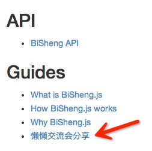

title: BiSheng.js
author:
  name: 墨智
  email: mozhi.gyy@alibaba-inc.com
output: lanlan.html
controls: true

--

<!-- 
    TODO 借用结构
    https://speakerdeck.com/zcbenz/node-webkit-app-runtime-based-on-chromium-and-node-dot-js 

    * BiSheng.js 是什么？
    * 应用场景
    * 快速开始
    * 实现细节
    * 问答
    * 一点私货
-->

<h1 style="color: #428BCA; ">
    <i class="iconlogo">&#x3438;</i>
    BiSheng.js
</h1>

<!-- # BiSheng.js -->
<!-- ## 　 -->

## 小巧轻便的数据双向绑定库

    
墨智 / 高云

    
[mozhi.gyy@alibaba-inc.com](mailto:mozhi.gyy@alibaba-inc.com)

    
<https://github.com/thx/bisheng>

    
<http://bishengjs.com/>

    

        <!-- <iframe src="http://ghbtns.com/github-btn.html?user=thx&repo=bisheng&type=watch&count=true&size=large" allowtransparency="true" frameborder="0" scrolling="0" width="131" height="30"></iframe>
        <iframe src="http://ghbtns.com/github-btn.html?user=thx&repo=bisheng&type=fork&count=true&size=large"allowtransparency="true" frameborder="0" scrolling="0" width="140" height="30"></iframe> -->
    

--

### 毕昇

<table>
    <tr>
        <td style="padding: 32px 0;">
            
        </td>
        <td style="padding: 32px 0 32px 32px;">
            
单向绑定犹如“刻版印刷”，

            
双向绑定犹如“活字印刷”，

            
故名 `BiSheng.js`。

        </td>
    </tr>
</table>

--

### 开始之前

[bishengjs.com](http://bishengjs.com/)

--

### 内容

* BiSheng.js 是什么
* 快速开始
* 应用场景和示例
* 实现细节
* 未来规划
* 问答
* 一点私货

<!-- 
    * 事件驱动编程
    * 数据驱动编程
    * 浏览器支持
    * 依赖关系
    * API
 -->

--

### BiSheng.js 是什么

小巧轻便的数据双向绑定库。

<table width="100%">
    <tr>
        <td></td>
        <td></td>
    </tr>
</table>

*图片来自 <http://docs.angularjs.org/guide/databinding>*

--

### BiSheng.js 是什么

* 帮助快速开发 Web 组件和应用
* 可以单独使用
* 可以方便地集成到第三方框架

    

*图片来自 <http://www.nerdssomosnozes.com/2009/08/nasce-o-bingoo-ou-yahing.html>*

--

### BiSheng.js 是什么

支持所有主流浏览器，包括 IE6。

<table width="100%">
    <tr>
        <td style="padding: 32px 32px 32px 0;">
            
        </td>
        <td style="padding: 32px 32px 32px 0;">
            
            
            
            
        </td>
    </tr>
    <tr>
        <td>6+</td>
        <td>(Current - 1) or Current</td>
    </tr>
</table>

--

### BiSheng.js 是什么

* 基于模板引擎 Handlebars.js 实现
* 可扩展支持其他基于语法树的模板引擎
* 兼容 jQuery 和 KISSY

    
    
    

--

### BiSheng.js 是什么

支持包管理器 Bower 和主流的模块加载器。

    
    
**AMD** *RequireJS*

    
**CMD** *SeaJS*

    
**KMD** *KISSY*
   

--
### BiSheng.js 是什么

* 数据驱动编程
    * Data-Driven Programming，DDP
    * 自动在 DOM 结构与数据模型之间建立映射关系
    * 事件也作为数据的一部分

前端应用程序应该以数据为中心，而不应该以处理和展现为中心。因为数据结构是稳定、唯一的，而业务和展现则是多变、多场景的。

<!-- 
* 事件驱动编程
    * Event-Driven Programming，EDP
    * 耦合了 DOM 结构、事件模型、数据模型
 -->

--

### 快速开始

1. 安装 BiSheng.js 和依赖库。

        bower install bishengjs

2. 引入 BiSheng.js, jQuery 和 Handlebars.js。

        
        
        

--
### 快速开始

1. 安装。。。
2. 引入。。。
3. 调用 `BiSheng.bind()`。

        var tpl = $('#hello').html()
        var data = {
            first: 'Zhi',
            last: 'Mo'
        }
        BiSheng.bind(data, tpl, function(content){
            $('.container').append(content)
        })
--
### 快速开始

<iframe width="100%" height="250" class="mt20" src="http://jsfiddle.net/zj2WF/embedded/js,html,result" allowfullscreen="allowfullscreen" frameborder="0"></iframe>

--

### 应用场景和示例

前端应用程序的场景可以归纳为四类：

* 表达式
* 逻辑块
* HTML 属性
* 表单

--
### 应用场景和示例

以表达式 `{{foo}}` 为例。

**首先**，我们定义容器节点 `div.container`、模板 `tpl` 和数据 `data`：

    

    var tpl = '{{foo}}'
    var data = {
        foo: 'foo'
    }

所有的准备工作已经就绪（这些步骤和普通的开发过程没什么区别），可以开始绑定模板 `tpl` 和数据 `data` 了。

--
### 应用场景和示例

**然后**，调用方法 `BiSheng.bind(data, tpl, context)` 执行双向绑定：

    BiSheng.bind(data, tpl, $('div.container'))

**最后**，用一个定时器 `setInterval` 来模拟数据的变化，改变数据时需要用 `BiSheng.apply(fn)` 包裹起来：

    setInterval(function(){
        BiSheng.apply(function(){
            data.foo = new Date()
        })
    }, 1000)

--
### 应用场景和示例

<iframe width="100%" height="250" class="mt20" src="http://jsfiddle.net/8gAjL/embedded/result,js,html" allowfullscreen="allowfullscreen" frameborder="0"></iframe>

实施 BiSheng.js 的步骤都是如此，所以，在后面的示例中，我不再罗列每个步骤，只展示运行结果。

--
### 应用场景和示例

以逻辑块 `{{#with story}}{{{intro}}}{{/with}}` 为例。

<iframe width="100%" height="280" src="http://jsfiddle.net/nNsrQ/embedded/js,html,result" allowfullscreen="allowfullscreen" frameborder="0"></iframe>

--

### 应用场景和示例

以 HTML 属性 `{{title}}` 为例。

<iframe width="100%" height="250" src="http://jsfiddle.net/nv7er/embedded/js,html,result" allowfullscreen="allowfullscreen" frameborder="0"></iframe>

--

### 应用场景和示例
--

### 实现细节

--

### 未来规划

--

### 问答

--

--

### 应用场景

* 表达式   `{{foo}}`
* 逻辑块   `{{#with story}}{{{intro}}}{{/with}}`
* 属性   `{{title}}`
* 表单   `<input class="form-control" value="{{first}}">`

--

### 应用场景

现在只支持 [Handlebars.js]。

下一步支持 [CROX](http://gitlab.alibaba-inc.com/thx/crox)、[KISSY XTemplate](http://docs.kissyui.com/1.4/docs/html/api/xtemplate/index.html)。

[Handlebars.js]: http://handlebarsjs.com/

--

### 浏览器支持

* Internet Explorer
    
    6+

* Chrome, Safari, Firefox, Opera
    
    前一个和当前版本（TODO）

--

### API

* BiSheng.bind(data, tpl, callback)

    在模板和数据之间执行双向绑定。

* BiSheng.unbind(data, tpl)

    解除数据和模板之间的双向绑定。

详细说明：[HTML](bisheng.html)，[Markdown](bisheng.md)。

--

### 示例

    // HTML 模板
    var tpl = '{{title}}'
    // 数据对象
    var data = {
      title: 'foo'
    }
    // 执行双向绑定
    BiSheng.bind(data, tpl, function(content){
      // 然后在回调函数中将绑定后的 DOM 元素插入文档中
      $('div.container').append(content)
    });

    // 改变数据 data.title，对应的文档区域会更新
    data.title = 'bar'

    // 解除双向绑定
    BiSheng.unbind(data, tpl);

    // 改变数据 data.title，对应的文档区域不会更新
    data.title = 'foo'

--

### API

* BiSheng.watch(data, fn(changes))

    为所有属性添加监听函数。

* BiSheng.unwatch(data, fn)
    
    移除监听函数。

详细说明：[HTML](bisheng.html)，[Markdown](bisheng.md)。

--

### 示例

    var data = { foo: 'foo' }
    BiSheng.watch(data, function(changes){
        console.log(JSON.stringify(changes, null, 4))
    })

    data.foo = 'bar'
    // => 见下一页
    
    setTimeout(function(){
        BiSheng.unwatch(data)
        data.foo = 'foo'
        // => 
    }, 1000)

--

### 示例

    // =>
    [
        {
            "type": "update",
            "path": [
                3,
                "foo"
            ],
            "value": "bar",
            "oldValue": "foo",
            "root": {
                "foo": "bar"
            },
            "context": {
                "foo": "bar"
            }
        }
    ]

--
### 开发方式

* 事件驱动编程 & 运行
* 数据驱动编程 & 运行

数据要比事件更容易驾驭。

<!-- 所以接下来，如果要在复杂数据和复杂代码中选择一个，宁愿选择前者。更进一步：在设计中，你应该主动将代码的复杂度转移到数据之中去。 -->

<http://localhost:5000/test/bisheng.html?noglobals=true&notrycatch=true&testNumber=66>

--
### 工作原理

1. 修改语法树，插入定位符。
2. 渲染模板和定位符。
3. 解析定位符。
4. 建立数据到 DOM 元素的连接。
5. 建立 DOM 元素到数据的连接。

详细说明：[HTML](how.html)，[Markdown](how.md)。

--

#### 以模板 `{{title}}` 为例

    // HTML 模板
    var tpl = '{{title}}'
    // 数据对象
    var data = {
      title: '注意，title 的值在这里'
    }
    // 执行双向绑定
    BiSheng.bind(data, tpl, function(content){
      // 然后在回调函数中将绑定后的 DOM 元素插入文档中
      $('div.container').append(content)
    });
    // 改变数据 data.title，对应的文档区域会更新
    data.title = 'bar'

--

#### 1. 修改语法树，插入定位符

    
    

    Handlebars.registerHelper('$lastest', function(items, options) {
        return items && items.$path || this && this.$path
    })

--

#### 2. 渲染模板和定位符

    Handlebars.compile(ast)(data)

    
    &lt;script guid="1" slot="start" type="" path="1.title" isHelper="false"&gt;&lt;/script&gt;
    注意，title 的值在这里
    &lt;script guid="1" slot="end"&gt;&lt;/script&gt;

--

#### 3. 扫描 DOM 元素，解析定位符

    
    注意，title 的值在这里
    

--

#### 4. 建立数据到 DOM 元素的连接

    script[slot="start"][path="1.title"]

--

#### 5. 建立 DOM 元素到数据的连接

    $(target).on('change.bisheng keyup.bisheng', function(event) {
        updateValue(data, path, event.target)
    })

--

### 回顾一下

* 应用场景
* 浏览器支持
* API
* 示例
* 开发方式
* 工作原理

> 只做一件事，并做好。——《Unix 编程艺术》

--

### 写作工具

* <https://github.com/jdan/cleaver/>
* <https://github.com/Bartvds/grunt-cleaver>

<link rel="stylesheet" href="../bower_components/highlightjs/styles/rainbow.css">

